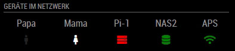

# MMM-NetworkScanner
A module for MagicMirror which determines the status of devices on the network based on their MAC address. It can also look up devices by IP addresses or hostnames. Static IP addresses work more consistently.

## Example

devices as rows<br/>


devices as columns<br/>


## Installation

In your terminal, install `arp-scan`:
````bash
cd ~/
sudo apt-get install arp-scan   
````

*Optionally*, update the vendor database used by `arp-scan`:
````bash
cd /usr/share/arp-scan
sudo get-iab -v -u http://standards-oui.ieee.org/iab/iab.txt
sudo get-oui -v -u http://standards-oui.ieee.org/oui/oui.txt
````

Clone this repository into the MagicMirror Modules folder:
````bash
cd ~/MagicMirror/modules
git clone https://github.com/ianperrin/MMM-NetworkScanner.git
````

Install the dependencies (`sudo`, `ping`) in the MMM-NetworkScanner module folder:
````
cd ~/MagicMirror/modules/MMM-NetworkScanner
npm install
````

Add the module to the modules array in the `config/config.js` file:
````javascript
    {
        module: 'MMM-NetworkScanner',
        position: 'top_left', 
        config: {
            // Optional config options
        }        
    },
````

## Config Options
| **Option** | **Default** | **Description** |
| --- | --- | --- |
| `devices` | [] | an array of devices to be found on the network. See [Device object](#device-object) |
| `network` | `-l` | `optional` a network mask to limit the scope of the network scan, i.e. `192.168.0.0/24`. If omitted, or set to `-l`, the entire network will be scanned. |
| `showUnknown` | true | `optional` shows devices found on the network even if not specified in the `devices` option |
| `showOffline` | true | `optional` shows devices specified in the `devices` option even when offline |
| `showLastSeen` | false | `optional` shows when the device was last seen e.g. "Device Name - last seen 5 minutes ago" |
| `keepAlive` | 180 | `optional` how long (in seconds) a device should be considered 'alive' since it was last found on the network |
| `updateInterval` | 20 | `optional` how often (in seconds) the module should scan the network |
| `sort` | `true` | `optional` sorts the devices in alphabetical order when shown in the mirror |
| `residents` | [] | `optional` an array of names of the devices that should be monitored if they are online |
| `occupiedCMD` | `{}` | `optional` the notification to be sent if one of the devices in the `residents` array is found online. See [Notification Example](#notification-example). |
| `vacantCMD` | `{}` | `optional` the notification to be sent if **NONE** of the devices in the `residents` array is found online. See [Notification Example](#notification-example). |
| `debug` | `false` | `optional` adds extended messages to the log. |
| `colored` | `false` | `optional` determines whether devices are shown in the color defined in the devices section. |
| `coloredSymbolOnly` | `false` | `optional` shows only the devices symbol. |
| `showLastSeenWhenOffline:` | `false` | `optional` show last seen only when offline. |
| `showDeviceColums:` | `false` | `optional` show devices as columns. |
| `coloredState:` | `false` | `optional` determines whether devices are shown in a color defined in the devices section and controlled by the online / offline state. |


#### Device Object
The device object contains information about the devices to be found on the network.

| **Key** | **Description** | **Example** |
| --- | --- | --- |
| `macAddress` | `optional` the MAC address of the device. | `aa:bb:cc:11:22:33` |
| `ipAddress` | `optional` the IP address **or** host name of the device. | `192.168.0.1` or `github.com` |
| `name` | `optional` the friendly name for the device. If omitted, the `macAddress` or `ipAddress` will be used. | `Phone` or `Router` |
| `icon` | `optional` the symbol to show next to the device. See [Font Awesome](http://fontawesome.io/cheatsheet/) cheatsheet. If omitted, `question` will be used. | There are a huge number of icons to choose from. Here are some examples: `globe`, `server`, `desktop`, `laptop`, `mobile`, `wifi`. |
| `color` | `optional` the color the device should be display with. | `#ff0000`  for red |
| `colorStateOnline` | `optional` the color the device should be display with when it is online. | `#ff0000`  for red |
| `colorStateOffline` | `optional` the color the device should be display with when it is offline. | `#ff0000`  for red |

**Note** A device object should only contain either a `macAddress` *or* an `ipAddress` **NOT** both.

**Note** The `coloredState` parameter overwrites the `colored` parameter if both parameters are set to true. With the parameter `coloredSymbolOnly` the status driven coloring can be limited to the icon. 

##### Generating the device array
The `devices` array can be generated by using `arps2mm.sh` from within the `scripts` folder. The output of the script will include all the devices found on the network, using the name of the vendor identified from the arp-scan result. Run the following script, edit the device names and icons then copy the array into the config file:

````bash
cd ~/MagicMirror/modules/MMM-NetworkScanner/scripts
chmod +x arps2mm.sh
./arps2mm.sh
````

**Note** Updating the vendor database is recommended before generating the device array. See the [installation instructions](#installation) for details.

### Example Config

#### Simple example
Scans the network (using the default `updateInterval`) and display the status of the four specified devices:
````javascript
    {
        module: "MMM-NetworkScanner",
        position: "top_left",
        header: "Who's home",
        config: {
            devices: [
                { macAddress: "1a:1b:1c:1a:1b:1c", name: "Dad", icon: "male"},
                { macAddress: "2a:2b:2c:2a:2b:2c", name: "Mum", icon: "female"},
                { macAddress: "3a:3b:3c:3a:3b:3c", name: "Son", icon: "male"},
                { macAddress: "4a:4b:4c:4a:4b:4c", name: "Daughter", icon: "female"}
            ],
            showUnknown: false,
        }
     }
````
#### example with columns
Displays the specified devices as columns:
````javascript
    {
        module: "MMM-NetworkScanner",
        position: "top_left",
        header: "Geräte im Netzwerk",
        config: {
            devices: [
                { 
                    ipAddress: "192.168.178.101", 
                    name: "UniFi", 
                    icon: "server", 
                    colorStateOnline: "green", 
                    colorStateOffline: "red",
                },
                { 
                    ipAddress: "192.168.178.31", 
                    name: "QNAP1", 
                    icon: "database", 
                    colorStateOnline: "green", 
                    colorStateOffline: "red",
                 },
                { 
                    ipAddress: "192.168.178.32", 
                    name: "QNAP2", 
                    icon: "database", 
                    colorStateOnline: "green", 
                    colorStateOffline: "red",
                },
                { 
                    ipAddress: "192.168.178.33", 
                    name: "QNAP3", 
                    icon: "database", 
                    colorStateOnline: "green", 
                    colorStateOffline: "red",
                },
                { 
                    ipAddress: "192.168.178.134", 
                    name: "APS", 
                    icon: "wifi", 
                    colorStateOnline: "green", 
                    colorStateOffline: "red",
                 },

            ],
            sort: false,
            showUnknown: false,
            showDeviceColums: true,
            coloredState: true,
        }
    }
````
#### Keep alive example
Scan every 5 seconds and only display the specified devices whether they are online or offline. Devices will continue to be shown as online (i.e. kept alive) for 5 mins after they are last found:
````javascript
    {
        module: 'MMM-NetworkScanner',
        position: 'top_left', 
        config: {
            devices: [
                    { ipAddress: "github.com", name: "Github", icon: "globe"},
                    { macAddress: "1a:1b:1c:1a:1b:1c", name: "Server", icon: "server"},
                    { macAddress: "2a:2b:2c:2a:2b:2c", name: "Desktop", icon: "desktop"},
                    { ipAddress: "10.1.1.10", name: "Laptop", icon: "laptop"},
                    { macAddress: "4a:4b:4c:4a:4b:4c", name: "Mobile", icon: "mobile"},
                ],
            showUnknown: false,
            showOffline: true,
            keepAlive: 300,
            updateInterval: 5
        }        
    },
````

#### Notification example
As with the previous example, this scans every 5 seconds and only display the specified devices whether they are online or offline. Devices will continue to be shown as online (i.e. kept alive) for 5 mins after they are last found on the network.

In addition, the module will send a notification (`occupiedCMD`) to turn the monitor on when either `Mobile` or `Laptop` (the `residents`) are found on the network. Another notification (`vacantCMD`) will be sent when neither device is online:
````javascript
    {
        module: 'MMM-NetworkScanner',
        position: 'top_left', 
        config: {
            devices: [
                    { ipAddress: "github.com", name: "Github", icon: "globe"},
                    { macAddress: "1a:1b:1c:1a:1b:1c", name: "Server", icon: "server"},
                    { macAddress: "2a:2b:2c:2a:2b:2c", name: "Desktop", icon: "desktop"},
                    { ipAddress: "10.1.1.10", name: "Laptop", icon: "laptop"},
                    { macAddress: "4a:4b:4c:4a:4b:4c", name: "Mobile", icon: "mobile"},
                ],
            showUnknown: false,
            showOffline: true,
            keepAlive: 300,
            updateInterval: 5,
            residents: ["Mobile", "Laptop"],
            occupiedCMD: {notification: 'REMOTE_ACTION', payload: {action: 'MONITORON'}},
            vacantCMD  : {notification: 'REMOTE_ACTION', payload: {action: 'MONITOROFF'}},

        }        
    },
````
**NOTE** The `REMOTE_ACTION` notifications (`MONITORON` and `MONITOROFF`) actions require the [MMM-Remote-Control](https://github.com/Jopyth/MMM-Remote-Control) module to be installed.

## Updating

To update the module to the latest version, use your terminal to go to your MMM-NetworkScanner module folder and type the following command:

````
cd ~/MagicMirror/modules/MMM-NetworkScanner
git pull
npm install
```` 

If you haven't changed the modules, this should work without any problems. 
Type `git status` to see your changes, if there are any, you can reset them with `git reset --hard`. After that, git pull should be possible.
