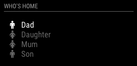

# MMM-NetworkScanner
A module for MagicMirror which determines the status of devices on the network based on their MAC address. It can also look up devices by IP addresses or hostnames. Static IP addresses work more consistently.

## Example



## Installation

In your terminal, install `arp-scan`:
````
cd ~/
sudo apt-get install arp-scan   
````

In your terminal, go to your MagicMirror's Module folder:
````
cd ~/MagicMirror/modules
````

Clone this repository:
````
git clone https://github.com/ianperrin/MMM-NetworkScanner.git
````

Go to the modules folder:
````
cd MMM-NetworkScanner
````

Install the dependencies (`sudo`, `ping`):
````
npm install
````

Add the module to the modules array in the `config/config.js` file:
````javascript
    {
        module: 'MMM-NetworkScanner',
        position: 'top_left', 
        config: {
            // Optional config options
        }        
    },
````

## Config Options
| **Option** | **Default** | **Description** |
| --- | --- | --- |
| `devices` | [] | an array of device objects e.g. { macAddress: "aa:bb:cc:11:22:33", name: "DEVICE-NAME", icon: "FONT-AWESOME-ICON"} |
| `network` | "" | Local Network IP mask, i.e. "192.168.0.0/24" |
| `showUnknown` | true | shows devices found on the network even if not specified in the `devices` option |
| `showOffline` | true | shows devices specified in the `devices` option even when offline |
| `showLastSeen` | false | shows when the device was last seen e.g. "Device Name - last seen 5 minutes ago" |
| `keepAlive` | 180 | how long (in seconds) a device should be considered 'alive' since it was last found on the network |
| `updateInterval` | 10 | how often (in seconds) the module should scan the network  |
| `residents` | [] | names of devices that should be monitored if they are in |
| `occupiedCMD` | `{notification: 'TEST', payload: {action: 'test-occupied'}}` | Notification to be sent when a resident returnes home e.g. `{notification: 'REMOTE_ACTION', payload: {action: 'MONITORON'}}` would turn the mirror on when a resedent returnes home. |
| `vacantCMD` | `{notification: 'TEST', payload: {action: 'test-occupied'}}` | Notification to be sent when all residents have left home. |

### Example Config
Scan every 5 seconds and only display the specified devices whether they are online or offline. Devices will be considered online for 5 mins after they are last seen:
````javascript
    {
        module: 'MMM-NetworkScanner',
        position: 'top_left', 
        config: {
            devices: [
                    { ipAddress: "github.com", name: "Github", icon: "globe"},
                    { macAddress: "1a:1b:1c:1a:1b:1c", name: "Server", icon: "server"},
                    { macAddress: "2a:2b:2c:2a:2b:2c", name: "Desktop", icon: "desktop"},
                    { ipAddress: "10.1.1.10", name: "Laptop", icon: "laptop"},
                    { macAddress: "4a:4b:4c:4a:4b:4c", name: "Mobile", icon: "mobile"},
                ],
            showUnknown: false,
            showOffline: true,
            keepAlive: 300,
            updateInterval: 5,
            residents: "Mobile",
            occupiedCMD: {notification: 'REMOTE_ACTION', payload: {action: 'MONITORON'}},
            vacantCMD  : {notification: 'REMOTE_ACTION', payload: {action: 'MONITOROFF'}},

        }        
    },
````

## Updating

To update the module to the latest version, use your terminal to go to your MMM-NetworkScanner module folder and type the following command:

````
cd ~/MagicMirror/modules/MMM-NetworkScanner
git pull
npm install
```` 

If you haven't changed the modules, this should work without any problems. 
Type `git status` to see your changes, if there are any, you can reset them with `git reset --hard`. After that, git pull should be possible.
